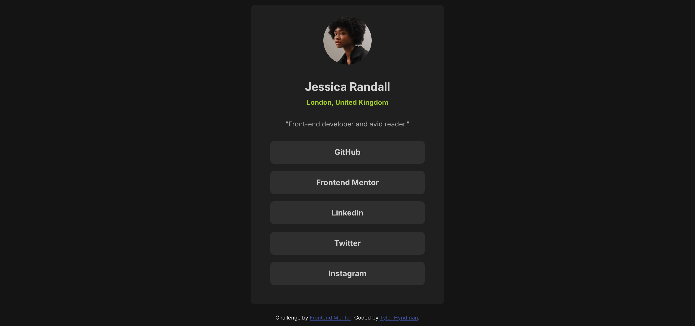

# Frontend Mentor - Social links profile solution

This is a solution to the [Social links profile challenge on Frontend Mentor](https://www.frontendmentor.io/challenges/social-links-profile-UG32l9m6dQ). Frontend Mentor challenges help you improve your coding skills by building realistic projects. 

## Table of contents

- [Overview](#overview)
  - [The challenge](#the-challenge)
  - [Screenshot](#screenshot)
  - [Links](#links)
- [My process](#my-process)
  - [Built with](#built-with)
  - [What I learned](#what-i-learned)
  - [Continued development](#continued-development)
- [Author](#author)

## Overview

### The challenge

Users should be able to:

- See hover and focus states for all interactive elements on the page

### Screenshot

 

### Links

- Solution URL: (https://github.com/tylerhyndman484/Social-Links-Profile.git)
- Live Site URL: (https://social-links-fm-project.netlify.app/)

## My process

### Built with

- Semantic HTML5 markup
- CSS custom properties
- CSS pseudo elements
- Flexbox
- CSS Grid
- Mobile-first workflow
- CSS media queries

### What I learned

I got a chance to play around with the flex property and making the links stretch the full length of the parent container. I also go to play around with some psuedo elements as well.

Code below that I am proud of:


```CSS
.socials {
  display: flex;
  flex-direction: column;
  gap: 15px;
}

.socials a {
  text-decoration: none;
  color: var(--clr-neutral-100);
  background-color: var(--clr-primary-400);
  border-radius: .5rem;
  opacity: .8;
  font-weight: var(--fw-bold);
  padding-top: .75rem;
  padding-bottom: .75rem;
}

.socials a:is(:hover, :focus) {
  background-color: var(--clr-accent-400);
  color: black; 
} 
```

### Continued development

I am going to continue working on pseudo element work such as :hover and :focus to be more comfortable. I also want to continue getting more comfortable with media queries as well and trying to find clever way to not always having to use them.

## Author

- Website - None yet
- Frontend Mentor - [@tylerhyndman484](https://www.frontendmentor.io/profile/tylerhyndman484)
- LinkedIn - [@Tyler Hyndman](https://www.linkedin.com/in/tyler-hyndman-11327b140/)
